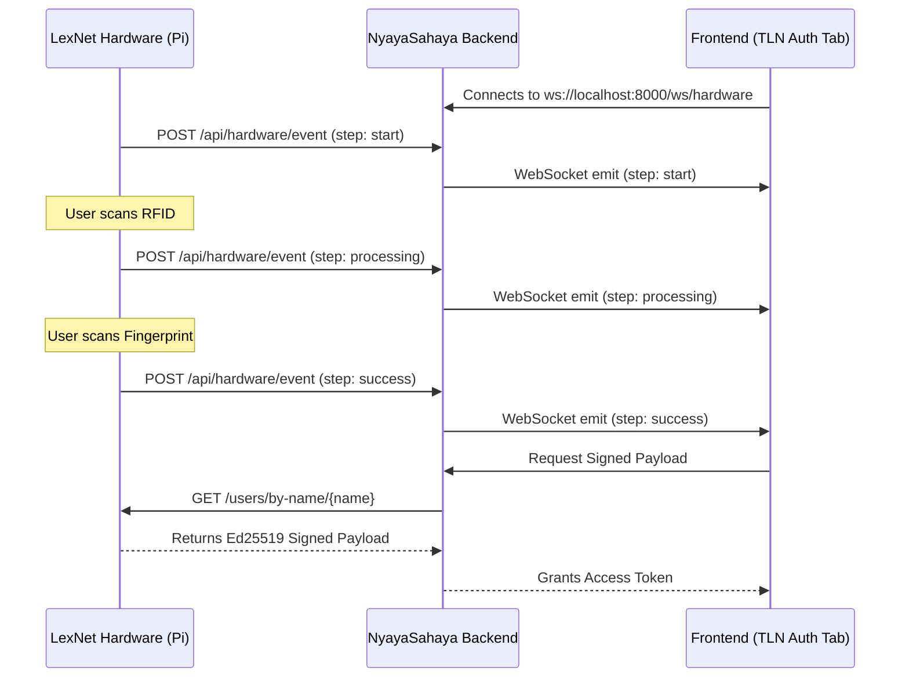

# Integration Plan: LexNet Hardware Auth & TLN Auth Tab

This document outlines the end-to-end integration of the physical LexNet hardware authentication modules (RFID and Fingerprint) with the NyayaSahaya frontend ("TLN Auth Tab" / `HardwareAuthPage.jsx`).

## Background

Currently, the LexNet hardware (Raspberry Pi) runs a standalone authentication loop and a minimal FastAPI server that serves cryptographically signed Ed25519 payloads for verified users. 

**Important Constraint:** As there are currently only **2 physical RFID cards**, the system is restricted to two users: 
- **Tejasvi** (Fingerprint Position 2, Card ID: 474254804681)
- **Sumadhva** (Fingerprint Position 3, Card ID: 495335117682)

The frontend's TLN Auth Tab is already designed to consume real-time WebSocket events (`ws/hardware`) to display a sleek UI progression:
1. Initial Handshake
2. Hardware ID Check (RFID)
3. Biometric Verification (Fingerprint)
4. Final Token Grant (Cryptographic Validation)

## Proposed Architecture 

To achieve a seamless integration without modifying the frontend heavily, we will implement an **Event-Driven Webhook-to-WebSocket Bridge** in the NyayaSahaya central backend.

---

## Developer Action Plan

### 1. Update LexNet Hardware (`lexnet/main.py`)
The hardware script currently relies on `oled_module.display` and `time.sleep()`. We need to add an HTTP client (like `requests`) to push real-time state changes to the central backend.

#### `lexnet/main.py`
- Import `requests`.
- Add a helper function `send_event(step: str, message: str)` that makes a `POST` request to `http://<CENTRAL_BACKEND_IP>:8000/api/hardware/webhook`.
- Inject `send_event('start', 'Scanning RFID...')` when waiting for a card.
- Inject `send_event('processing', 'Verifying Biometrics...')` when the RFID is successfully scanned and waiting for a fingerprint.
- Inject `send_event('success', 'Access Granted')` upon successful fingerprint match.

### 2. NyayaSahaya Backend Updates (`backend/app/main.py`)
The central backend must act as the bridge between the hardware and the frontend.

#### Hardware Webhooks & WebSockets Route
- **WebSocket Endpoint (`/ws/hardware`)**:
  - Accept incoming connections from `HardwareAuthPage.jsx`.
  - Maintain a set of active connections.
- **Webhook Endpoint (`POST /api/hardware/webhook`)**:
  - Accept JSON payload `{"type": "auth_event", "data": {"step": "...", "message": "..."}}` from the LexNet Pi.
  - Broadcast this payload to all active WebSocket connections.
- **Verification Proxy (`POST /api/hardware/verify`)**:
  - Fetch the cryptographically signed payload from the Pi's API (`http://10.121.116.14:8000/users/by-name/{name}`).
  - Verify the Ed25519 signature to ensure the payload hasn't been tampered with.
  - Issue the final JWT or session token to the frontend.

### 3. Frontend Integration (`src/pages/HardwareAuthPage.jsx`)
The frontend is already built to react to `start`, `processing`, and `success` WebSocket events. 

#### `src/pages/HardwareAuthPage.jsx`
- Verify that the WebSocket URL correctly points to the central NyayaSahaya backend (e.g., `ws://localhost:8000/ws/hardware` for local dev).
- When the `success` event is received via WebSocket, automatically trigger a `fetch` to the backend to retrieve the token instead of relying on the manual "Simulate Hardware Auth" button.
- **UI Constraints**: Add a visual disclaimer or note indicating that hardware authentication is currently limited to authorized administrators (Tejasvi & Sumadhva) due to physical key limitations.

---

## Open Questions & Considerations

- **Network Accessibility**: The Raspberry Pi (LexNet) currently has the IP `10.121.116.14:8000`. We need to ensure that the NyayaSahaya backend is running on a machine that can communicate with this IP on the local network. 
- **User Broadcast**: Since there are only 2 RFID cards available, the Pi should broadcast the detected user's name during the `success` webhook event, so the frontend knows exactly which cryptographic payload to request and verify.

## Verification Plan

### Automated Tests
- Send mock webhook `POST` requests to the NyayaSahaya backend and verify that the frontend UI progresses through the 4 steps autonomously without manual interaction.
- Test the Ed25519 signature verification function in isolation using the payload structure from `lexnet/api_server.py`.

### Manual Verification
1. Boot the backend server and start the Vite frontend.
2. Navigate to the TLN Auth Tab.
3. Tap one of the 2 configured RFID cards on the LexNet hardware.
4. Verify the frontend instantly updates to "Biometric Verification".
5. Place the corresponding finger on the scanner.
6. Verify the frontend updates to "Success" and displays the access granted state with the user's name.
