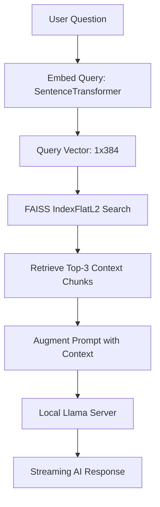
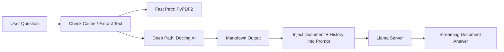
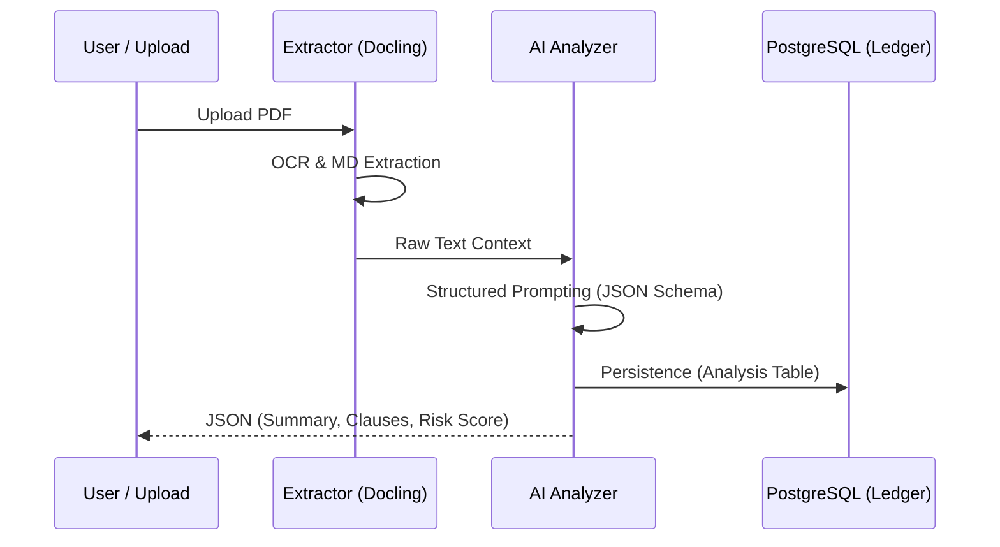

# NyayaSahaya RAG Architecture & Pipeline Deep Dive

LexNet (NyayaSahaya) implements a hybrid Retrieval-Augmented Generation (RAG) system tailored for the Indian legal domain. This document details the technical implementation of vector embeddings, indexing, and the multi-path query processing logic.

---

## 1. Vector Embedding Infrastructure

The core of our retrieval system relies on dense vector representation. Unlike traditional keyword search, vector embeddings capture semantic meaning, allowing the system to understand legal concepts even if specific keywords differ.

### Technical Specification
- **Transformer Model**: `sentence-transformers/all-MiniLM-L6-v2`
- **Embedding Dimensions**: 384-dimensional dense floating-point vectors.
- **Normalization**: Vectors are kept in raw L2 space for use with `IndexFlatL2`.
- **Inference Engine**: Local execution via `SentenceTransformer` library, ensuring data privacy and low-latency local processing.

### Mathematical Pipeline
1. **Input**: A text chunk $T$ is passed through the MiniLM transformer.
2. **Pooling**: Mean pooling is applied to the token embeddings to produce a single sentence embedding $v \in \mathbb{R}^{384}$.
3. **Similarity**: Distance between query $q$ and document $d$ is calculated using **Squared Euclidean Distance ($L2$ Distance)**:
   $$d(q, d) = \sum_{i=1}^{384} (q_i - d_i)^2$$

---

## 2. Global RAG Pipeline (The "Frontend Query")

Used in the main chat interface for general legal inquiries. It retrieves context from a pre-built knowledge base of Indian laws (IPC, CrPC, etc.).

### Retrieval Logic
- **Storage**: `faiss_index/legal_index.faiss`
- **Retrieval Strategy**: `k=3` (retrieving the top 3 most relevant legal segments).
- **Context Window**: Chunks are approximately 2000 characters, providing a balanced context without overwhelming the local LLM's transformer window.

---

## 3. Local Doc RAG (The "Chat with Document")

When a user chats with a specific uploaded PDF, LexNet switches to a high-precision local context mode.

### Technical Nuance
- **Context Injection**: Unlike Global RAG, Doc RAG injects the *entire* relevant text of the document (up to a 15,000 character buffer) into the prompt.
- **Why No FAISS?**: For individual legal documents (contracts/FIRs), cross-referencing within the same document is often more accurate via full-text grounding than chunk-based retrieval, as it preserves macro-structural context (definitions sections, etc.).

---

## 4. AI Analysis & Summarization (Question Summary)

This path focuses on extraction/transformation rather than retrieval, turning unstructured legal PDFs into structured JSON data.

### Extractor Hierarchy (Stability First)
1. **DB Cache**: Instant hit if analyzed before.
2. **PyPDF2**: Non-AI fast extraction for simple text-based PDFs.
3. **Docling AI**: Fallback for scanned documents or complex layouts (uses proprietary AI models for layout-aware parsing).

---

## 5. Comparative Table

| Feature | Global RAG | Doc RAG | AI Analysis |
| :--- | :--- | :--- | :--- |
| **Data Source** | `legal_index.faiss` | Specific Document Buffer | Specific Document Buffer |
| **Logic** | Semantic Vector Search | Full Context Grounding | Structured Schema Extraction |
| **Objective** | General Legal Advice | Q&A on private files | Risk & Compliance Overview |
| **Latency** | Medium (Vector + LLM) | Low (Direct LLM) | High (Extraction + LLM) |
| **Embeddings** | Used for Search | Not Used (Direct Text) | Not Used (Direct Text) |

---
> [!IMPORTANT]
> All processing is done locally. No legal data leaves your environment. The vector embeddings are generated on-the-fly and matched against the FAISS index sitting on the local filesystem.
